# 🔍 Phân Tích Kỹ Thuật Buổi 4 — So Sánh Với Buổi 3

## 1. Tổng Quan Các Kỹ Thuật Được Sử Dụng Trong Buổi 4

### Pipeline 6 bước trong hàm [`process_image()`](file:///d:/Cole/AI engineer LV up/buoi_4_colab_detection.py#L60-L259)

| Bước | Kỹ thuật | Mô tả |
|------|----------|-------|
| **1** | `cv2.minAreaRect()` — Border ngoài | Tách nền xanh (B-R > 30), morphology, tìm contour → lấy hình chữ nhật xoay bao quanh toàn bộ sản phẩm |
| **2** | `cv2.bitwise_and()` — Loại nền | Áp mask foreground lên ảnh gốc để xóa hoàn toàn nền |
| **3** | `cv2.warpAffine()` — Xoay thẳng | Đo độ dày 2 đầu (hàm `get_thickness`) → xác định đầu cos → xoay ảnh cho sản phẩm nằm ngang |
| **4** | Cắt cố định từ đỉnh (tip) | Tìm `x_tip` (mép phải nhất) → cắt lùi về `fixed_crop_length` px |
| **5** | Inner border (border bên trong) | Dùng tỷ lệ % cố định trên ảnh đã chuẩn hóa để vẽ border cho vùng barrel + brush |
| **6** | `cv2.resize()` → ROI 224×224 | Cắt ROI từ inner border → resize về kích thước cố định |

### Các kỹ thuật bổ sung:
- **YOLOv8 Classification** ([Cell 5](file:///d:/Cole/AI engineer LV up/buoi_4_colab_detection.py#L539-L578)): Train model **phân loại** (classify) thay vì detection
- **Sobel sub-millimeter** ([Cell 6](file:///d:/Cole/AI engineer LV up/buoi_4_colab_detection.py#L589-L681)): Đo lường chính xác trên ROI đã chuẩn hóa (kế thừa từ buổi 3, nhưng chạy trên ROI mới)

---

## 2. Khác Biệt Giữa Buổi 3 và Buổi 4

### 📊 Bảng So Sánh Chi Tiết

| Tiêu chí | Buổi 3 | Buổi 4 |
|-----------|--------|--------|
| **Mục tiêu chính** | Detection (phát hiện vật thể) | Classification (phân loại OK/NG) |
| **Hàm chính** | [`auto_detect_bboxes()`](file:///d:/Cole/AI engineer LV up/buoi_3_colab_detection.py#L61-L153) | [`process_image()`](file:///d:/Cole/AI engineer LV up/buoi_4_colab_detection.py#L60-L259) |
| **Output** | Tọa độ AABB (bounding box) cho YOLO | Ảnh ROI 224×224 px đã chuẩn hóa |
| **Cách lấy ROI** | Cắt trực tiếp AABB từ ảnh gốc (KHÔNG xoay) | Xoay thẳng → cắt cố định từ đỉnh → inner border → resize |
| **Xử lý xoay** | Chỉ tính toán hộp xoay, rồi chuyển về AABB thẳng đứng | **Thực sự xoay ảnh** bằng `warpAffine` → sản phẩm luôn nằm ngang |
| **Loại nền** | ❌ Không (ROI vẫn có nền) | ✅ Có — `bitwise_and` với mask |
| **Chuẩn hóa kích thước** | ❌ ROI kích thước tùy ảnh | ✅ Luôn 224×224 px |
| **Xác định hướng đầu cos** | Đơn giản: `if dx < 0` đảo chiều | Nâng cao: đo **độ dày thực tế** tại 2 đầu (33% chiều dài) |
| **Model train** | YOLOv8 **Detection** (`yolov8n.pt`) | YOLOv8 **Classification** (`yolov8n-cls.pt`) |
| **Gán nhãn** | Tạo file `.txt` YOLO (bounding box) | Phân loại thủ công vào thư mục `OK/` hoặc `NG/` |
| **Số border** | 1 border (outer) + 1 inspect area | 2 border: **outer** (toàn sản phẩm) + **inner** (vùng phân tích) |
| **Vùng tìm peak Sobel** | Hardcode pixel: `[10:60]` và `[100:145]` | Dùng **tỷ lệ %**: `[10%-40%]` và `[55%-80%]` của `w_roi` |

### 🔑 3 Khác Biệt Cốt Lõi

#### a) Triết lý tiếp cận hoàn toàn khác

```
Buổi 3: Ảnh gốc → YOLO Detection → cắt ROI → đo lường
         (Train model TÌM vị trí vật thể)

Buổi 4: Ảnh gốc → Xử lý ảnh chuẩn hóa ROI → YOLO Classification → đo lường
         (Train model PHÂN LOẠI chất lượng sản phẩm)
```

#### b) ROI buổi 3 vs buổi 4

- **Buổi 3**: ROI = cắt thẳng AABB → ảnh bị xoay, kích thước khác nhau, còn nền xanh
- **Buổi 4**: ROI = xoay nắn thẳng + cắt từ đỉnh + inner border + resize → ảnh chuẩn hóa, luôn cùng kích thước, không nền

#### c) Gán nhãn đơn giản hơn

- **Buổi 3**: Phải gán nhãn **bounding box** (tọa độ x, y, w, h) — phức tạp
- **Buổi 4**: Chỉ cần **kéo ảnh** vào thư mục OK/ hoặc NG/ — rất đơn giản

---

## 3. Kiến Thức Được Phát Triển (So Với Buổi 3)

| # | Kiến thức mới / phát triển | Chi tiết |
|---|---------------------------|----------|
| 1 | **Image Rectification (Nắn thẳng ảnh)** | Buổi 3 chỉ tính góc xoay. Buổi 4 **thực sự xoay ảnh** bằng `cv2.getRotationMatrix2D()` + `cv2.warpAffine()` |
| 2 | **Background Removal** | Kỹ thuật mới: dùng `bitwise_and` với foreground mask để loại bỏ hoàn toàn nền |
| 3 | **Orientation Detection bằng đo độ dày** | Thay vì dùng dấu của `dx` (buổi 3), buổi 4 đo **thickness thực tế** tại 2 đầu → chính xác hơn |
| 4 | **Fixed-length Cropping từ tip** | Cắt ảnh cùng chiều dài cố định từ đỉnh sản phẩm → chuẩn hóa vị trí |
| 5 | **2-level Border System** | Outer border (toàn sản phẩm) + Inner border (vùng barrel) — buổi 3 chỉ có 1 level |
| 6 | **YOLOv8 Classification** | Chuyển từ object detection sang image classification — ý nghĩa: model nhìn **toàn bộ ROI** thay vì tìm bounding box |
| 7 | **Percentage-based search** | Tìm peak Sobel bằng % thay vì hardcode pixel → thích ứng với ROI kích thước khác nhau |
| 8 | **Pipeline tích hợp** | Gộp mọi bước vào 1 hàm `process_image()` thay vì 2 hàm riêng rẽ như buổi 3 |

---

## 4. ⭐ Khi Vẽ Lại Border — Chỉ Số Nào Thay Đổi?

> [!IMPORTANT]
> Border trong buổi 4 có **2 loại**: Outer Border và Inner Border. Câu hỏi "vẽ lại border" chủ yếu liên quan đến **Inner Border** (border bên trong).

### Inner Border — Các chỉ số cần điều chỉnh

Inner border được định nghĩa tại [dòng 223-237](file:///d:/Cole/AI engineer LV up/buoi_4_colab_detection.py#L223-L237):

```python
# Hai chỉ số % theo CHIỀU NGANG (trục X):
inner_x_left  = int(w_std * 0.20)    # ← THAY ĐỔI SỐ 0.20 để dịch mép trái
inner_x_right = int(w_std * 0.42)    # ← THAY ĐỔI SỐ 0.42 để dịch mép phải

# Chiều DỌC (trục Y) — tự động tính theo mask sản phẩm:
inner_y_top  = product_rows[0] - 3   # margin 3px (có thể thay đổi)
inner_y_bot  = product_rows[-1] + 3  # margin 3px (có thể thay đổi)
```

### 📐 Bảng chỉ số khi vẽ lại border

| Chỉ số | Giá trị hiện tại | Ý nghĩa | Thay đổi để... |
|--------|-------------------|----------|-----------------|
| **`0.20`** (dòng 223) | 20% `w_std` | Mép **trái** inner border | Dịch sang trái (giảm) hoặc phải (tăng) vùng ROI |
| **`0.42`** (dòng 224) | 42% `w_std` | Mép **phải** inner border | Mở rộng (tăng) hoặc thu hẹp (giảm) vùng ROI |
| **`3`** (dòng 236) | 3 px margin | Margin **trên** sản phẩm | Thêm/bớt khoảng trống dọc |
| **`3`** (dòng 237) | 3 px margin | Margin **dưới** sản phẩm | Thêm/bớt khoảng trống dọc |

> [!TIP]
> - Muốn border **rộng hơn** (bao thêm vùng): giảm `0.20` và/hoặc tăng `0.42`
> - Muốn border **hẹp hơn** (chỉ lấy chính xác barrel): tăng `0.20` và/hoặc giảm `0.42`
> - Muốn border **cao hơn**: tăng margin (3 → 5, 10...)

### Outer Border — Thay đổi gì?

Outer border tại [dòng 115](file:///d:/Cole/AI engineer LV up/buoi_4_colab_detection.py#L115) được tính **tự động** từ `cv2.minAreaRect()`, nên không có chỉ số thủ công để chỉnh. Tuy nhiên, các tham số gián tiếp ảnh hưởng:

| Chỉ số | Dòng | Ý nghĩa |
|--------|------|----------|
| `30` (ngưỡng B-R) | [89](file:///d:/Cole/AI engineer LV up/buoi_4_colab_detection.py#L89) | Độ nhạy tách nền — tăng = bỏ nhiều nền hơn |
| `(9,9)` kernel | [93](file:///d:/Cole/AI engineer LV up/buoi_4_colab_detection.py#L93) | Kích thước morphology — tăng = ít nhiễu nhưng mất chi tiết |
| `5000` area | [104](file:///d:/Cole/AI engineer LV up/buoi_4_colab_detection.py#L104) | Diện tích contour tối thiểu |
| `2.5` aspect ratio | [108](file:///d:/Cole/AI engineer LV up/buoi_4_colab_detection.py#L108) | Tỷ lệ dài/ngắn tối thiểu để coi là sản phẩm |

### Tham số `fixed_crop_length` (liên quan gián tiếp)

| Chỉ số | Dòng | Mặc định | Ý nghĩa |
|--------|------|----------|----------|
| `fixed_crop_length` | [60](file:///d:/Cole/AI engineer LV up/buoi_4_colab_detection.py#L60) | 300 px | Chiều dài cắt từ đỉnh — ảnh hưởng đến `w_std` → ảnh hưởng inner border |

> [!CAUTION]
> Khi thay đổi `fixed_crop_length`, tỷ lệ `0.20` và `0.42` vẫn giữ nguyên nhưng **vị trí thực tế (pixel)** sẽ thay đổi. Cần kiểm tra lại visual output sau khi chỉnh.

---

## 5. Sơ Đồ Pipeline So Sánh

```mermaid
graph TD
    subgraph "Buổi 3 — Detection"
        A3["Ảnh gốc"] --> B3["Tách nền B-R > 30"]
        B3 --> C3["minAreaRect + AABB"]
        C3 --> D3["Tính inspect area<br/>(69.2% chiều dài)"]
        D3 --> E3["Xuất nhãn YOLO .txt"]
        D3 --> F3["Cắt ROI thẳng (AABB)"]
        F3 --> G3["Sobel đo lường<br/>(hardcode pixel)"]
    end

    subgraph "Buổi 4 — Classification"
        A4["Ảnh gốc"] --> B4["Tách nền B-R > 30"]
        B4 --> C4["minAreaRect<br/>(Outer Border)"]
        C4 --> D4["Loại nền (bitwise_and)"]
        D4 --> E4["Xoay thẳng<br/>(warpAffine)"]
        E4 --> F4["Cắt cố định<br/>từ đỉnh (tip)"]
        F4 --> G4["Inner Border<br/>(% cố định)"]
        G4 --> H4["Resize 224×224"]
        H4 --> I4["YOLO Classify<br/>OK / NG"]
        H4 --> J4["Sobel đo lường<br/>(% tỷ lệ)"]
    end

    style A3 fill:#ff9999
    style A4 fill:#99ff99
    style I4 fill:#99ccff
    style E3 fill:#ffcc99
```


